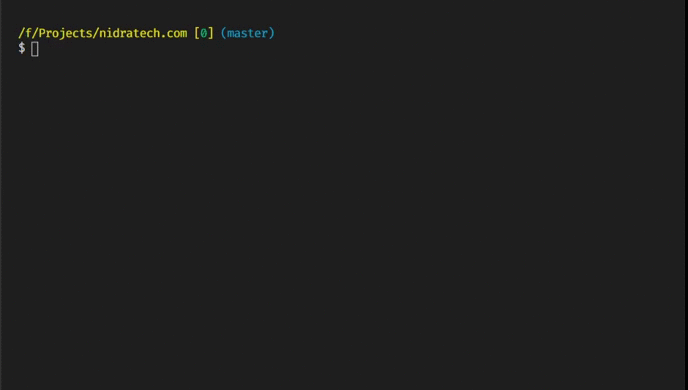

# Next Deploy

Effortless deployment to AWS and GitHub Pages for Next.js apps 🚀

## Table of Contents

- [Getting Started](#Getting-Started)
- [Features](#Features)
- [Background](#Background)
- [CLI](#CLI)
  - [Distributed Deployments](#Distributed-Deployments)
- [Environment](#Environment)
  - [AWS](#AWS)
  - [GitHub](#GitHub)
- [Configuration Options](#Configuration-Options)
  - [Base Options](#Base-Options)
  - [AWS Options](#AWS-Options)
  - [GitHub Options](#GitHub-Options)
- [Advanced Usage](#Advanced-Usage)
  - [Redirecting Domains](#Redirecting-Domains)
  - [Deployment State](#Deployment-State)
  - [CI/CD](#CICD)
- [Examples](#Examples)

## Getting Started

Make sure your environment is [configured to deploy](#Environment).

- `yarn add --dev next-deploy`
- `yarn next-deploy`

Or as a one-liner:

- `npx next-deploy`

You can safely add the `.next-deploy` and `.next-deploy-build` directories to your `.gitignore`.



## Features

Next Deploy strives to support the latest

- ✔ effortless deployment to AWS and GitHub pages
- ✔ deployments to a custom domain
- ✔ static generation (SSG), server side rendering (SSR)
- ✔ serverless AWS architecture serving your Next.js content globally via [CloudFront](https://aws.amazon.com/cloudfront/) and [Lambda@Edge](https://aws.amazon.com/lambda/edge/)
- ✔ multi-environment support
- ⚠ getStaticPaths with fallback
- ⚠ preview mode
- ⚠ incremental static regeneration

## Background

Next Deploy was created to deploy web applications built using the wonderful [Next.js](https://nextjs.org/) framework. It allows teams to easily integrate with the supported engines (AWS, GitHub Pages) and keep the entirety of their code in source control. From frontend, to backend, to the deployment logic. Next Deploy started as a fork of serverless-next.js which itself is an orchestrator of various orphaned serverless-components.

## CLI

Next Deploy comes with a `next-deploy [argument]` CLI that you can run with `npx next-deploy` or `yarn next-deploy`.

There are currently 5 supported arguments:

- **default** (default): Runs **Build** followed by **Deploy**.

- **init**: Creates the base next-deploy.config.js configuration for your project.

- **build**: Build the application for deployment.

- **deploy**: Deploy the built application.

- **remove**: Remove the deployed resources. Note that some resources (such as lambda@edge lambdas need to be cleaned up manually due to a timing constraint).

### Distributed Deployments

Note how `build` and `deploy` can be run separately through the CLI. This allows for creating build artifacts that could be deployed at a later time. You may want to publish such build artifacts to your private artifactory for later retrieval (can be useful for rollbacks) and/or analysis. Consider publishing with the following config in your `package.json`:

```javascript
"files": [
    ".next/!(cache)", // not needed for deployment and is very large in size
    ".next-deploy",
    ".next-deploy-build",
    "next-deploy.config.js"
  ]
```

## Environment

### AWS

To deploy to AWS you will need to set your credentials in your environment:

```bash
AWS_ACCESS_KEY_ID=******
AWS_SECRET_ACCESS_KEY=******
```

If your account is restricted, ensure that you have enough permissions to deploy.
You will need the following permissions:

<details>
  <summary>Click to view</summary>

```javascript
[
  'acm:DescribeCertificate', // only for custom domains
  'acm:ListCertificates', // only for custom domains
  'acm:RequestCertificate', // only for custom domains
  'cloudfront:CreateCloudFrontOriginAccessIdentity',
  'cloudfront:CreateDistribution',
  'cloudfront:CreateInvalidation',
  'cloudfront:GetDistribution',
  'cloudfront:GetDistributionConfig',
  'cloudfront:ListCloudFrontOriginAccessIdentities',
  'cloudfront:ListDistributions',
  'cloudfront:ListDistributionsByLambdaFunction',
  'cloudfront:ListDistributionsByWebACLId',
  'cloudfront:ListFieldLevelEncryptionConfigs',
  'cloudfront:ListFieldLevelEncryptionProfiles',
  'cloudfront:ListInvalidations',
  'cloudfront:ListPublicKeys',
  'cloudfront:ListStreamingDistributions',
  'cloudfront:UpdateDistribution',
  'iam:AttachRolePolicy',
  'iam:CreateRole',
  'iam:CreateServiceLinkedRole',
  'iam:GetRole',
  'iam:PassRole',
  'lambda:CreateFunction',
  'lambda:EnableReplication',
  'lambda:DeleteFunction', // only for custom domains
  'lambda:GetFunction',
  'lambda:GetFunctionConfiguration',
  'lambda:PublishVersion',
  'lambda:UpdateFunctionCode',
  'lambda:UpdateFunctionConfiguration',
  'route53:ChangeResourceRecordSets', // only for custom domains
  'route53:ListHostedZonesByName',
  'route53:ListResourceRecordSets', // only for custom domains
  's3:CreateBucket',
  's3:GetAccelerateConfiguration',
  's3:GetObject',
  's3:HeadBucket',
  's3:ListBucket',
  's3:PutAccelerateConfiguration',
  's3:PutBucketPolicy',
  's3:PutObject',
];
```

</details>

### GitHub

No specific environment configuration is necessary. By default, your app will be built and [exported](https://nextjs.org/docs/advanced-features/static-html-export) to the `gh-pages` branch.

## Configuration Options

The next-deploy config varies by the provider (engine) that you're deploying to. All configuration options are optional and come with sensible defaults.
The deployment configuration is to be provided through `next-deploy.config.js`, which will be automatically created for you the first time you run `next-deploy` or `next-deploy init`.

### Base Options

All engines support the basic options:

| Name          | Type                  | Default | Description                                                                                                                                  |
| ------------- | --------------------- | ------- | -------------------------------------------------------------------------------------------------------------------------------------------- |
| build         | [`Build`](#Build)     | `{}`    | Build related options.                                                                                                                       |
| debug         | `boolean`             | `false` | Print helpful messages to                                                                                                                    |
| domain        | `string \| string[]`  | `null`  | The deployment domain.                                                                                                                       |
| engine        | `"aws" \| "github"`   | `aws`   | The platform to deploy to.                                                                                                                   |
| nextConfigDir | `string`              | `./`    | The directory holding the `next.config.js`.                                                                                                  |
| onPostDeploy  | `() => Promise<void>` | `null`  | A callback that gets called after the deployment successfully finishes.                                                                      |
| onPreDeploy   | `() => Promise<void>` | `null`  | A callback that gets called before the deployment.                                                                                           |
| onShutdown    | `() => Promise<void>` | `null`  | A callback that gets called after the deployment is shutdown by a INT/QUIT/TERM signal like from ctrl+c.                                     |
| stage         | [`Stage`](#Stage)     | `local` | Configure the stage ('dev', 'staging', 'production') of your deployment that will be used to synchronize its deployed state to an S3 bucket. |

#### Build

| Name | Type       | Default                  | Description                                          |
| ---- | ---------- | ------------------------ | ---------------------------------------------------- |
| args | `string[]` | `['build']`              | A list of arguments to provide to the build command. |
| cmd  | `string`   | `node_modules/.bin/next` | The build command.                                   |
| cwd  | `string`   | `./`                     | The current working directory.                       |

#### Stage

| Name       | Type      | Default                    | Description                                                                               |
| ---------- | --------- | -------------------------- | ----------------------------------------------------------------------------------------- |
| bucketName | `string`  | `next-deploy-environments` | The S3 bucket name to sync the deployment stage to. `local` deployments don't get synced. |
| name       | `string`  | `local`                    | The name of the stage.                                                                    |
| versioned  | `boolean` | `false`                    | Whether the S3 bucket containing the stage's state should be versioned.                   |

### AWS Options

| Name                 | Type                                                        | Default                                                                               | Description                                                                                                                                                                                                         |
| -------------------- | ----------------------------------------------------------- | ------------------------------------------------------------------------------------- | ------------------------------------------------------------------------------------------------------------------------------------------------------------------------------------------------------------------- |
| bucketName           | `string`                                                    | `*auto generated*`                                                                    | Custom bucket name where static assets are stored.                                                                                                                                                                  |
| bucketRegion         | `string`                                                    | `us-east-1`                                                                           | Region where you want to host your S3 bucket.                                                                                                                                                                       |
| cloudfront           | [`CloudFront`](#CloudFront)                                 | `{}`                                                                                  | Additional cloudfront options.                                                                                                                                                                                      |
| description          | `string`                                                    | <details>`"*lambda type* handler for the Next CloudFront distribution."`</details>    | A description of the lambda.                                                                                                                                                                                        |
| domainType           | `"www" \| "apex" \| "both"`                                 | `both`                                                                                | Can be one of: "**apex**" - apex domain only, don't create a www subdomain. "**www**" - www domain only, don't create an apex subdomain. "**both**" - create both www and apex domains when either one is provided. |
| memory               | `number`                                                    | `512`                                                                                 | The amount of memory that a lambda has access to. Increasing the lambda's memory also increases its CPU allocation. The value must be a multiple of 64 MB.                                                          |
| name                 | `string`                                                    | `*auto generated*`                                                                    | The name of the lambda function.                                                                                                                                                                                    |
| policy               | `string`                                                    | <details>`arn:aws:iam::aws:policy/service-role/AWSLambdaBasicExecutionRole`</details> | The arn policy of the lambda.                                                                                                                                                                                       |
| publicDirectoryCache | `boolean \|`[`PublicDirectoryCache`](#PublicDirectoryCache) | `true`                                                                                | Customize the public/static directory asset caching policy. Assigning an object lets you customize the caching policy and the types of files being cached. Assigning false disables caching.                        |
| runtime              | `string`                                                    | `nodejs12.x`                                                                          | The identifier of the lambda's runtime.                                                                                                                                                                             |
| timeout              | `number`                                                    | `10`                                                                                  | The amount of time that the lambda allows a function to run before stopping it. The maximum allowed value is 900 seconds.                                                                                           |

### Github Options

| Name    | Type                                                     | Default                                               | Description                                                                              |
| ------- | -------------------------------------------------------- | ----------------------------------------------------- | ---------------------------------------------------------------------------------------- |
| publish | [`Publish`](https://github.com/tschaub/gh-pages#options) | `{message: "Next Deployment Update", dotfiles: true}` | The [git-hub page options](https://github.com/tschaub/gh-pages#options) to publish with. |

#### PublicDirectoryCache

| Name  | Type     | Default                                                   | Description                              |
| ----- | -------- | --------------------------------------------------------- | ---------------------------------------- |
| test  | `string` | `/\.(gif\|jpe?g\|jp2\|tiff\|png\|webp\|bmp\|svg\|ico)$/i` | The test to apply the caching behaviour. |
| value | `string` | `public, max-age=31536000, must-revalidate`               | The caching behavior.                    |

#### CloudFront

| Name                   | Type                                                       | Default             | Description                                                                                                                                                 |
| ---------------------- | ---------------------------------------------------------- | ------------------- | ----------------------------------------------------------------------------------------------------------------------------------------------------------- |
| fieldLevelEncryptionId | `string`                                                   | `""`                | The value of the ID for the field-level encryption configuration that you want to use.                                                                      |
| forward                | [`Forward`](#Forward)                                      | `{}`                | Determines the forwarding configuration                                                                                                                     |
| smoothStreaming        | `boolean`                                                  | `false`             | Indicates whether you want to distribute media files in the Microsoft Smooth Streaming format.                                                              |
| priceClass             | `"PriceClass_All" \| "PriceClass_200" \| "PriceClass_100"` | `PriceClass_All`    | THe price class which determines the reach of the edge locations that will be used to serve your app.                                                       |
| ttl                    | `number`                                                   | `0`                 | The amount of time that you want objects to stay in CloudFront's cache before it forwards another request to determine whether the object has been updated. |
| viewerCertificate      | [`ViewerCertificate`](#ViewerCertificate)                  | `{}`                | Determines the SSL/TLS configuration for communicating with viewers.                                                                                        |
| viewerProtocolPolicy   | `string`                                                   | `redirect-to-https` | The policy for viewers to access the content.                                                                                                               |
| "lambda@edge"          | [`LambdaAtEdge`](#LambdaAtEdge)                            | `{}`                | Additional lambda@edge functions.                                                                                                                           |

#### Forward

| Name                 | Type                 | Default | Description                                                              |
| -------------------- | -------------------- | ------- | ------------------------------------------------------------------------ |
| cookies              | `string \| string[]` | `all`   | Indicates which cookies should be forwarded.                             |
| queryString          | `boolean`            | `true`  | Indicates whether the query string should be forwarded.                  |
| headers              | `string[]`           | `[]`    | Headers to forward (whitelisted headers).                                |
| queryStringCacheKeys | `string[]`           | `[]`    | Details of the query string parameters that you want to use for caching. |

#### ViewerCertificate

| Name                   | Type     | Default        | Description                                                                                                                                                                                                                                                                                                                        |
| ---------------------- | -------- | -------------- | ---------------------------------------------------------------------------------------------------------------------------------------------------------------------------------------------------------------------------------------------------------------------------------------------------------------------------------- |
| ACMCertificateArn      | `string` | `null`         | If the SSL/TLS certificate is stored in ACM, provide the ARN of the ACM certificate. CloudFront only supports ACM certificates in the us-east-1.                                                                                                                                                                                   |
| SSLSupportMethod       | `string` | `sni-only`     | Specifies which viewers the distribution accepts HTTPS connections from. **sni-only** – The distribution accepts HTTPS connections only from viewers that support server SNI (all modern browsers). **vip** – The distribution accepts HTTPS connections from **all** (not recommended and results in additional monthly charges). |
| minimumProtocolVersion | `string` | `TLSv1.2_2018` | The security policy that you want to use for HTTPS connections with viewers.                                                                                                                                                                                                                                                       |

#### LambdaAtEdge

| Name                 | Type                                         | Default | Description                                                             |
| -------------------- | -------------------------------------------- | ------- | ----------------------------------------------------------------------- |
| \*cloudfront event\* | `string \| {arn:string,includeBody:boolean}` | `null`  | The customization for a new CloudFront event handler (lambda function). |

## Advanced Usage

### Redirecting Domains

For AWS deployments, when using the `domainType` option with either `apex` or `domain` values, the automatic redirection from the unsupported domain type will not automatically work, but there are manual one time steps you [outlined here](https://simonecarletti.com/blog/2016/08/redirect-domain-https-amazon-cloudfront/#configuring-the-amazon-s3-static-site-with-redirect). In summary, you will have to create a new S3 bucket and set it up with static website hosting to redirect requests to your supported subdomain type (ex. "www.example.com" or "example.com"). To be able to support HTTPS redirects, you'll need to set up a CloudFront distribution with the S3 redirect bucket as the origin. Finally, you'll need to create an "A" record in Route 53 with your newly created CloudFront distribution as the alias target.

## Deployment State

For AWS deployments, Next Deploy must know the state of your previous deployment, otherwise it will start spinning up new instances. You may find the local state files in your `.next-deploy` directory.

When working on a team or trying to implement [CI/CD](#CICD) it is advisable to persist the deployment state for each stage using the `stage` AWS option. Alternatively, one may backup and restore the deployment state by using the `onPreDeploy` and `onPostDeploy` callbacks.

### CI/CD

Implement [CI/CD](https://en.wikipedia.org/wiki/CI/CD) in your workflow with Next Deploy by substituting environment variables into your `next-deploy.config.js`.

Consider an advanced configuration example:

```javascript
module.exports = {
  bucketName: process.env.MY_APP_BUCKET_NAME,
  description: process.env.MY_APP_LAMBDA_DESCRIPTION,
  name: {
    requestLambda: process.env.MY_APP_REQUEST_LAMBDA_NAME,
  },
  domain: [process.env.MY_APP_SUBDOMAIN, process.env.MY_APP_DOMAIN],
  stage: {
    name: process.env.ENVIRONMENT,
    versioned: true,
    bucketName: 'next-environments',
  },
  cloudfront: {
    defaults: {
      'lambda@edge': {
        'viewer-request': process.env.MY_AUTH_LAMBDA_ARN,
      },
    },
  },
  debug: true,
};
```

The most important configuration option in the example above is `stage`. It will allow for the deployment state to be persisted in S3 and it will be synced with the locale state at the start of every build.

While implementing CI/CD in your project, consider following the [latest Next.js guidelines for storing](https://nextjs.org/docs/basic-features/environment-variables#loading-environment-variables) and loading the environment variables in `.env*` files.

## Examples

Check out the two examples for AWS and GitHub in the [examples folder](/examples) to get a sense of what the implementation will entail and how it will run when deployed.
